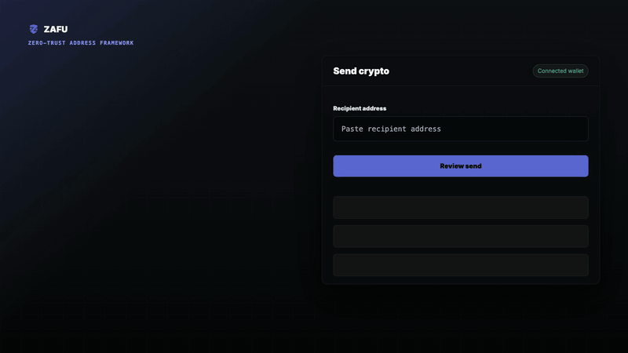

# Zafu — Zero-trust Address Framework for Users

**Send to the right address. Every time.**

[](https://chromewebstore.google.com/detail/zafu-%E2%80%94-zero-trust-address/lgfngnmhlmpeakbjclnfehgnlnaecjgm)




Sending crypto still asks you to trust a tiny paste field with irreversible money.

Zafu gives every transfer one final address check before you send. It compares copied vs pasted addresses, looks for poisoned lookalikes and known scam signals, shows the full address in readable chunks, and lets you confirm with more confidence.

---

## The threat is real

Zafu is built for everyday peace of mind, but the risks it checks for are real:

- **3.4 million** address poisoning attempts on Ethereum in January 2026 — up 5.5× in two months
- **$300 million** lost to phishing in January 2026 alone
- **$713 million** drained via clipboard hijacking browser extensions in 2025

Attackers don't need your seed phrase. They just need you to copy from your own transaction history.

---

## How the attack works

An attacker sends a zero-value transaction to your wallet from a lookalike address — same first 6 characters, same last 4, completely different middle. It appears in your transaction history. Next time you go to send, you copy the fake instead of the real one.

```
Real:  0x71C7 656EC 7ab88b 098def B09a29 c3a0f1
Fake:  0x71C7 1a4D2 7ab88b 098def d8329c 3a02e4f
                ↑↑↑↑↑ Different here            ↑↑↑ and here
```

MetaMask shows `0x71C7...a0f1`. The fake shows `0x71C7...02e4`. Without the middle, you can't tell. Zafu shows all 40 characters, in readable segments, with the differing chunks highlighted in red.

---

## What Zafu catches

| State | Trigger | What you see |
|---|---|---|
| **CLIPBOARD_MISMATCH** | Pasted address differs from the last same-chain address Zafu saw copied in the browser | Amber review modal, user can cancel or manually verify and paste |
| **POISONED** | Near-match to a trusted address (shared prefix+suffix or Hamming ≤ 2) | Red modal, full segmented diff, both addresses compared |
| **SCAM** | Matches bundled blocklist or GoPlus real-time check | Red modal, no override |
| **SUSPICIOUS** | In history but never sent to (zero-value inbound) | Confirm modal, verification checkbox |
| **KNOWN** | Exact match in your trusted history | Green banner, auto-confirms in 2s |
| **KNOWN_PUBLIC** | Major DeFi contract (Uniswap, WETH, Aave, etc.) | Green banner |
| **UNKNOWN** | Never seen before | Confirm modal, verification checkbox |

Core poisoning and copy-mismatch checks run locally. Network-backed checks include GoPlus, chain-history providers, ENS resolution, and the optional community threat list.

---

## Install

**[→ Chrome Web Store](https://chromewebstore.google.com/detail/zafu-%E2%80%94-zero-trust-address/lgfngnmhlmpeakbjclnfehgnlnaecjgm)** — free, no account required

**Developer mode (unpacked):**
```
git clone https://github.com/jimozo/zafu-extension.git
```
1. Open `chrome://extensions` → enable **Developer mode**
2. Click **Load unpacked** → select the `extension/` folder
3. Reload any crypto tabs

---

## Architecture

Chrome MV3. Pure vanilla JS. Zero npm dependencies.

| File | Role |
|------|------|
| `content/content-script.js` | Copy/paste interception, overlay injection |
| `background/service-worker.js` | Message handlers, API calls, storage |
| `lib/address-comparator.js` | 9-state detection pipeline |
| `lib/storage.js` | chrome.storage.local wrappers |
| `lib/etherscan-client.js` | Etherscan V2 API wrapper |
| `lib/index-builder.js` | tx history → trusted/suspicion index |
| `lib/self-audit.js` | Scan trusted index for poisoned near-matches |
| `overlay/overlay.js` | Shadow DOM overlay renderer |

Four isolated execution contexts communicate via message passing and `chrome.storage`.

---

## Permissions

Zafu requests **3 permissions**. The average Chrome extension requests 17.

| Permission | Why |
|---|---|
| `storage` | Saves wallet list and trusted address index locally on your device |
| `alarms` | Schedules 24h refreshes for opted-in wallets and community intelligence |
| `identity` | Optional Google Sign-In for address-book backup and restore |

No `webRequest`. No `nativeMessaging`. No wallet API. Zafu cannot sign transactions, move funds, or read private keys — by architecture, not policy.

---

## Verify your install

Every release ships with a **16-character fingerprint** computed from Zafu's security-critical files and bundled risk data. Open Zafu → **Settings** → **Trust & Integrity** to compare against the fingerprint published with the public extension release.

They match → your install is unmodified. Full instructions: [VERIFY.md](VERIFY.md)

---

## Trust principles

- **No advertising telemetry** — optional Network Mode can share anonymous aggregate usage counts, never addresses, labels, clipboard text, chat text, URLs, balances, transaction hashes, Google ID, or email
- **Offline-first** — POISONED and copy-mismatch checks run with zero network calls
- **No external dependencies** — no npm, no bundler, no CDN scripts
- **Strict CSP** — no `eval`, no remote scripts, no inline code execution
- **Public extension source** — the Chrome extension release source is auditable

---

## Security

Found a vulnerability? Email **security@stayzafu.com** before public disclosure.

---

## Forks

Forks are welcome under MIT. If your fork proves real-world value, tell us — we recognize serious downstream work and may invite focused improvements back upstream.

---

## License

MIT
